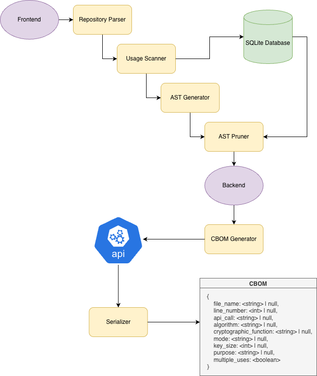

# open-pqc-inventory

## Normative References
[Cryptoscope](https://research.ibm.com/publications/cryptoscope-analyzing-cryptographic-usages-in-modern-software)

[On Criteria and Tooling for Cryptographic Inventories](https://www.researchgate.net/publication/381728957_On_Criteria_and_Tooling_for_Cryptographic_Inventories)

## Data
[Encrypted Web Traffic Dataset: Event Logs and Packet Traces](https://www.scidb.cn/en/detail?dataSetId=ec72229d46624e4e8b8528dd0485f5b4)

## Diagram


## Results

### Detection in open source JavaScript project [hybrid-crypto-js](https://github.com/juhoen/hybrid-crypto-js)

```json
[
    {
        "file_name": "/Users/abrahambrege/dev/open-pqc-inventory/frontend/tmp/da6a5875-e246-4de3-a57e-490c88d653be/repo/lib/rsa.js",
        "line_number": null,
        "api_call": "publicKeyToPem(publicKey)",
        "algorithm": "RSA",
        "cryptographic_function": "key serialization",
        "mode": null,
        "key_size": null,
        "purpose": "Format RSA public key as PEM for transport or storage",
        "multiple_uses": true
    },
    {
        "file_name": "/Users/abrahambrege/dev/open-pqc-inventory/frontend/tmp/da6a5875-e246-4de3-a57e-490c88d653be/repo/src/index.js",
        "line_number": null,
        "api_call": "require('./rsa')",
        "algorithm": "RSA",
        "cryptographic_function": null,
        "mode": null,
        "key_size": null,
        "purpose": null,
        "multiple_uses": false
    },
    {
        "file_name": "/Users/abrahambrege/dev/open-pqc-inventory/frontend/tmp/da6a5875-e246-4de3-a57e-490c88d653be/repo/lib/index.js",
        "line_number": null,
        "api_call": "require('./rsa')",
        "algorithm": "RSA",
        "cryptographic_function": null,
        "mode": null,
        "key_size": null,
        "purpose": "Likely RSA cryptography: key generation, encryption, decryption, or signing (based on import)",
        "multiple_uses": false
    },
    {
        "file_name": "src/webpack.js",
        "line_number": null,
        "api_call": "RSA",
        "algorithm": "RSA",
        "cryptographic_function": null,
        "mode": null,
        "key_size": null,
        "purpose": null,
        "multiple_uses": false
    },
    {
        "file_name": "lib/constants.js",
        "line_number": null,
        "api_call": null,
        "algorithm": "AES-CBC",
        "cryptographic_function": null,
        "mode": "CBC",
        "key_size": null,
        "purpose": null,
        "multiple_uses": true
    },
    {
        "file_name": "src/constants.js",
        "line_number": null,
        "api_call": null,
        "algorithm": "AES",
        "cryptographic_function": null,
        "mode": "CBC",
        "key_size": null,
        "purpose": null,
        "multiple_uses": true
    },
    {
        "file_name": "test/test.js",
        "line_number": null,
        "api_call": "new RSA()",
        "algorithm": "RSA",
        "cryptographic_function": "keygen",
        "mode": null,
        "key_size": null,
        "purpose": "asymmetric key generation for public-key cryptography",
        "multiple_uses": true
    },
    {
        "file_name": "/Users/abrahambrege/dev/open-pqc-inventory/frontend/tmp/da6a5875-e246-4de3-a57e-490c88d653be/repo/src/rsa.js",
        "line_number": null,
        "api_call": "publicKeyToPem(publicKey)",
        "algorithm": "RSA",
        "cryptographic_function": "key encoding (public key to PEM)",
        "mode": null,
        "key_size": null,
        "purpose": "Convert RSA public key object to PEM format for distribution or storage.",
        "multiple_uses": true
    },
    {
        "file_name": "/Users/abrahambrege/dev/open-pqc-inventory/frontend/tmp/da6a5875-e246-4de3-a57e-490c88d653be/repo/lib/webpack.js",
        "line_number": null,
        "api_call": "require('./rsa')",
        "algorithm": "RSA",
        "cryptographic_function": null,
        "mode": null,
        "key_size": null,
        "purpose": "Imports RSA cryptographic module (purpose unclear from AST)",
        "multiple_uses": false
    },
    {
        "file_name": "src/crypt.js",
        "line_number": 204,
        "api_call": "forge.random.getBytesSync",
        "algorithm": null,
        "cryptographic_function": "keygen",
        "mode": null,
        "key_size": null,
        "purpose": "IV or key material generation",
        "multiple_uses": false
    },
    {
        "file_name": "lib/crypt.js",
        "line_number": null,
        "api_call": "privateKey.sign",
        "algorithm": "RSA",
        "cryptographic_function": "sign",
        "mode": null,
        "key_size": null,
        "purpose": "digital signature generation",
        "multiple_uses": true
    }
]

```
### Network Analyzer
```
================================================================================
CIPHER SUITE ANALYSIS SUMMARY
================================================================================
Total packets analyzed: 100,000
Packets with cipher suites: 1,042
Unique cipher suites found: 22

CIPHER SUITE BREAKDOWN:
--------------------------------------------------
0x1302: TLS_AES_256_GCM_SHA384                          Count:    614 (58.9%)
0x1301: TLS_AES_128_GCM_SHA256                          Count:    120 (11.5%)
0x0A0A: GREASE_0A0A                                     Count:     28 (2.7%)
0xC02B: TLS_ECDHE_ECDSA_WITH_AES_128_GCM_SHA256         Count:     22 (2.1%)
0x2A2A: GREASE_2A2A                                     Count:     22 (2.1%)
0x1A1A: GREASE_1A1A                                     Count:     21 (2.0%)
0xEAEA: GREASE_EAEA                                     Count:     20 (1.9%)
0xFAFA: GREASE_FAFA                                     Count:     19 (1.8%)
0xCACA: GREASE_CACA                                     Count:     19 (1.8%)
0x5A5A: GREASE_5A5A                                     Count:     17 (1.6%)
0xDADA: GREASE_DADA                                     Count:     17 (1.6%)
0x9A9A: GREASE_9A9A                                     Count:     16 (1.5%)
0x3A3A: GREASE_3A3A                                     Count:     15 (1.4%)
0x8A8A: GREASE_8A8A                                     Count:     14 (1.3%)
0xC030: TLS_ECDHE_RSA_WITH_AES_256_GCM_SHA384           Count:     14 (1.3%)
0xAAAA: GREASE_AAAA                                     Count:     13 (1.2%)
0xBABA: GREASE_BABA                                     Count:     13 (1.2%)
0x7A7A: GREASE_7A7A                                     Count:     12 (1.2%)
0x4A4A: GREASE_4A4A                                     Count:     10 (1.0%)
0x6A6A: GREASE_6A6A                                     Count:      9 (0.9%)
0xC02F: TLS_ECDHE_RSA_WITH_AES_128_GCM_SHA256           Count:      4 (0.4%)
0x00FF: UNKNOWN_00FF                                    Count:      3 (0.3%)
```
Partial output:
```
[
  {
    "packet_number": 28,
    "timestamp": "2026-01-13 10:44:22.555148",
    "length": 571,
    "layers": [
      "eth",
      "ip",
      "tcp",
      "tls"
    ],
    "cipher_suite_id": "0x1301",
    "cipher_suite_name": "TLS_AES_128_GCM_SHA256",
    "tls_version": "0x0301",
    "src_port": 58411,
    "dst_port": 443,
    "protocol": "6",
    "cipher_suite_name_decoded": "TLS_AES_128_GCM_SHA256",
    "application_info": {
      "src_application": null,
      "dst_application": "zotero"
    },
    "cipher_suite_metadata": {
      "is_post_quantum": true,
      "is_grease": false,
      "is_unknown": false,
      "cipher_suite_id_numeric": 4865
    }
  },
  {
    "packet_number": 31,
    "timestamp": "2026-01-13 10:44:22.572856",
    "length": 153,
    "layers": [
      "eth",
      "ip",
      "tcp",
      "tls"
    ],
    "cipher_suite_id": "0x1302",
    "cipher_suite_name": "TLS_AES_256_GCM_SHA384",
    "tls_version": "0x0303",
    "src_port": 443,
    "dst_port": 58411,
    "protocol": "6",
    "cipher_suite_name_decoded": "TLS_AES_256_GCM_SHA384",
    "application_info": {
      "src_application": "zotero",
      "dst_application": null
    },
    "cipher_suite_metadata": {
      "is_post_quantum": true,
      "is_grease": false,
      "is_unknown": false,
      "cipher_suite_id_numeric": 4866
    }
  },
  {
    "packet_number": 33,
    "timestamp": "2026-01-13 10:44:22.573213",
    "length": 398,
    "layers": [
      "eth",
      "ip",
      "tcp",
      "tls"
    ],
    "cipher_suite_id": "0x1301",
    "cipher_suite_name": "TLS_AES_128_GCM_SHA256",
    "tls_version": "0x0303",
    "src_port": 58411,
    "dst_port": 443,
    "protocol": "6",
    "cipher_suite_name_decoded": "TLS_AES_128_GCM_SHA256",
    "application_info": {
      "src_application": null,
      "dst_application": "zotero"
    },
    "cipher_suite_metadata": {
      "is_post_quantum": true,
      "is_grease": false,
      "is_unknown": false,
      "cipher_suite_id_numeric": 4865
    }
  },
  {
    "packet_number": 35,
    "timestamp": "2026-01-13 10:44:22.594630",
    "length": 1514,
    "layers": [
      "eth",
      "ip",
      "tcp",
      "tls"
    ],
    "cipher_suite_id": "0x1302",
    "cipher_suite_name": "TLS_AES_256_GCM_SHA384",
    "tls_version": "0x0303",
    "src_port": 443,
    "dst_port": 58411,
    "protocol": "6",
    "cipher_suite_name_decoded": "TLS_AES_256_GCM_SHA384",
    "application_info": {
      "src_application": "zotero",
      "dst_application": null
    },
    "cipher_suite_metadata": {
      "is_post_quantum": true,
      "is_grease": false,
      "is_unknown": false,
      "cipher_suite_id_numeric": 4866
    }
  },
  ...
]
```

### SSH Key Storage Analyzer
```
================================================================================
SSH KEY CRYPTOGRAPHIC ANALYSIS SUMMARY
================================================================================
Total SSH keys analyzed: 59
Unique hosts: 11
Key types found: 3

KEY TYPE DISTRIBUTION:
----------------------------------------
ssh-ed25519               Count:   22 ( 37.3%) - Ed25519
ssh-rsa                   Count:   19 ( 32.2%) - RSA
ecdsa-sha2-nistp256       Count:   18 ( 30.5%) - ECDSA P-256

SECURITY LEVEL DISTRIBUTION:
-----------------------------------
high         Count:   41 ( 69.5%)
medium       Count:   18 ( 30.5%)

POST-QUANTUM CRYPTOGRAPHY READINESS:
---------------------------------------------
vulnerable   Count:   37 ( 62.7%)
resistant    Count:   22 ( 37.3%)

RSA KEY SIZE DISTRIBUTION:
------------------------------
3072 bits:   19 keys (high)

DUPLICATE KEYS ACROSS HOSTS:
-----------------------------------
Found 1 keys used across multiple hosts
   Key (ssh-ed25519): 2 hosts

```

### Package Analyzer

```
================================================================================
SOURCE CODE CRYPTOGRAPHIC LIBRARY ANALYSIS
================================================================================
Files scanned: 648,594
Files with crypto usage: 6,062
Programming languages detected: 5
Unique crypto libraries found: 112

ANALYSIS BY PROGRAMMING LANGUAGE:
---------------------------------------------
PYTHON          Files: 34912 | Crypto: 4800 | Libraries: 99
C_CPP           Files: 14151 | Crypto: 184 | Libraries:  5
JAVA            Files:   64 | Crypto:  52 | Libraries:  3
JAVASCRIPT      Files: 2313 | Crypto: 932 | Libraries:  9
RUST            Files:    2 | Crypto:   0 | Libraries:  0
SWIFT           Files:    3 | Crypto:   0 | Libraries:  0
RUBY            Files: 2738 | Crypto:  88 | Libraries:  3
GO              Files:    1 | Crypto:   0 | Libraries:  0

CRYPTOGRAPHIC LIBRARIES DETECTED:
----------------------------------------
                            (6434 occurrences)
  re                        (3155 occurrences)
  cryptography              (1874 occurrences)
  ssl                       (494 occurrences)
  hashlib                   (318 occurrences)
  paramiko                  (238 occurrences)
  openssl                   (210 occurrences)
  org                       (206 occurrences)
  a                         (198 occurrences)
  java                      (178 occurrences)
  dom                       (104 occurrences)
  lib                       (99 occurrences)
  sodium                    (98 occurrences)
  to                        (96 occurrences)
  node-forge                (80 occurrences)

SECURITY ANALYSIS:
--------------------
High risk files: 3
Post-quantum ready: 31.1% (4606/14792)

Results exported to: crypto_source_packages.json

10186 cryptographic dependencies are not post-quantum ready
```